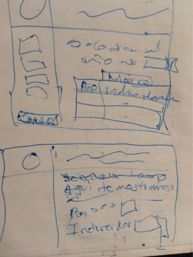
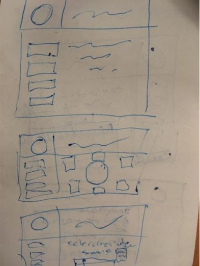
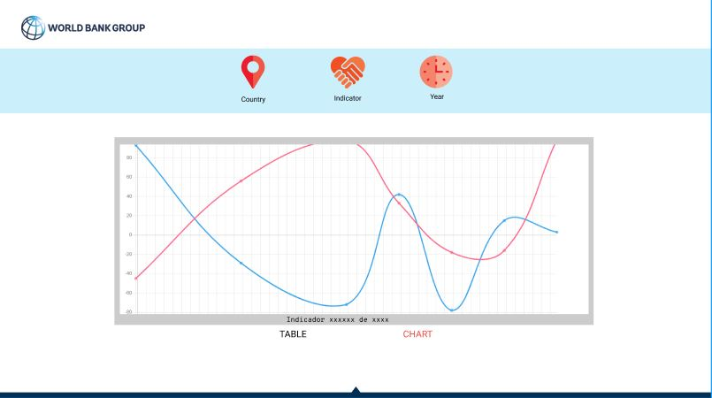
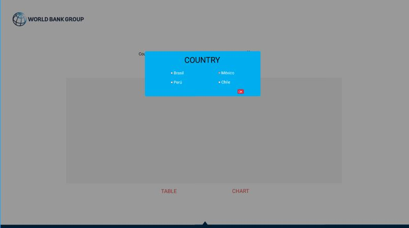
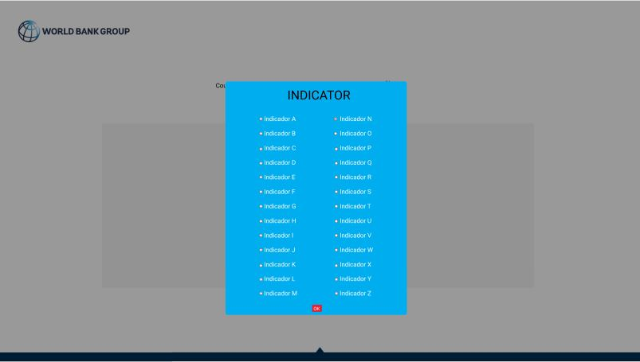
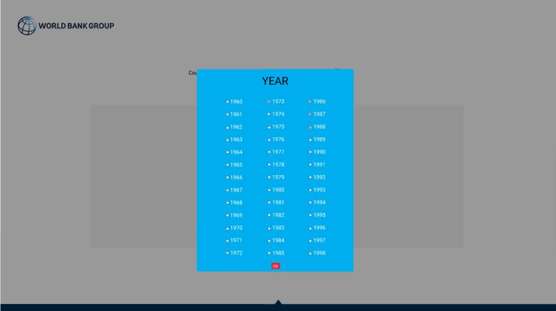

Guías visuales: http://pubdocs.worldbank.org/en/754991511203317714/WBG-VIG-20171114.pdf

# Data Lovers

## Índice

* [1. Resúmen](#1-resúmen)
* [2. Objetivos de aprendizaje](#2-objetivos-de-aprendizaje)
* [3. Proceso](#3-proceso)

***
## 1. Resúmen

★Crear una propuesta de web-app (responsive) para filtrar, buscar y comparar información sobre los Índices de Desarrollo Humano (IDH) proporcionados por el Banco Mundial.

★Graficar la información para poder visualizarla de manera sencilla.

★Crear un diseño sencillo e intuitivo para encontrar la información que se busca rapidamente.

★Hacer comparaciones a través de tres parámetros:
  -País
  -Indicador
  -Año

## 2. Objetivos de aprendizaje

El objetivo principal de este proyecto es que, entendiendo las necesidades de
tus usuarios, aprendas a diseñar y construir una interfaz web donde se pueda
visualizar y manipular data.

Revisa la lista y reflexiona sobre los objetivos que conseguiste en el
proyecto anterior. Piensa en eso al decidir tu estrategia de trabajo individual
y de equipo.

### UX

- [ ] Diseñar la aplicación pensando y entendiendo al usuario.
- [x] Crear prototipos para obtener _feedback_ e iterar.
- [ ] Aplicar los principios de diseño visual (contraste, alineación, jerarquía).
- [ ] Planear y ejecutar _tests_ de usabilidad.

### HTML y CSS

- [x] Entender y reconocer por qué es importante el HTML semántico.
- [x] Identificar y entender tipos de selectores en CSS.
- [ ] Entender como funciona `flexbox` en CSS.
- [ ] Construir tu aplicación respetando el diseño planeado (maquetación).

### DOM

- [x] Entender y reconocer los selectores del DOM (querySelector | querySelectorAll).
- [x] Manejar eventos del DOM. (addEventListener)
- [x] Manipular dinámicamente el DOM. (createElement, appendchild, innerHTML, value)

### Javascript

- [ ] Manipular arrays (`filter` | `map` | `sort` | `reduce`).
- [x] Manipular objects (key | value).
- [x] Entender el uso de condicionales (`if-else` | `switch`).
- [x] Entender el uso de bucles (`for` | `forEach`).
- [ ] Entender la diferencia entre expression y statements.
- [x] Utilizar funciones (parámetros | argumentos | valor de retorno).
- [ ] Entender la diferencia entre tipos de datos atómicos y estructurados.
- [ ] Utilizar ES Modules (`import` | `export`).

### Pruebas Unitarias (_testing_)
- [ ] Testear funciones (funciones puras).

### Git y GitHub
- [x] Ejecutar comandos de git (`add` | `commit` | `pull` | `status` | `push`).
- [ ] Utilizar los repositorios de GitHub (`clone` | `fork` | gh-pages).
- [x] Colaborar en Github (pull requests).

### Buenas prácticas de desarrollo
- [ ] Organizar y dividir el código en módulos (Modularización).
- [ ] Utilizar identificadores descriptivos (Nomenclatura | Semántica).
- [ ] Utilizar linter para seguir buenas prácticas (ESLINT).

## 3. Proceso

**Prototipo de baja fidelidad: **

**Prototipo de alta fidelidad:**

**Historias de usuario**

Se crearon tres historias de usuario que se desarrollaron a través de tres sprints: 

1. El usuario podrá desplegar y escoger a través de un <select>, la lista de países y el indicador deseado. Se desplegará la información de los años y porcentaje en una tabla.                                                                                                                                                                                                                                          . 2. El usuario podrá seleccionar un país, un indicador y distintos años a través de ventanas modales. Posteriormente se desplegará la información sólo de los años elegidos en una tabla HTML. El usuario podrá seleccionar un país, un indicador y distintos años a través de ventanas modales. Además podrá elegir entre desplegar la información en una tabla o gráfica.
  
 3. El usuario podrá seleccionar un país, un indicador y distintos años a través de ventanas modales. Además podrá elegir entre desplegar la información en una tabla o gráfica.
